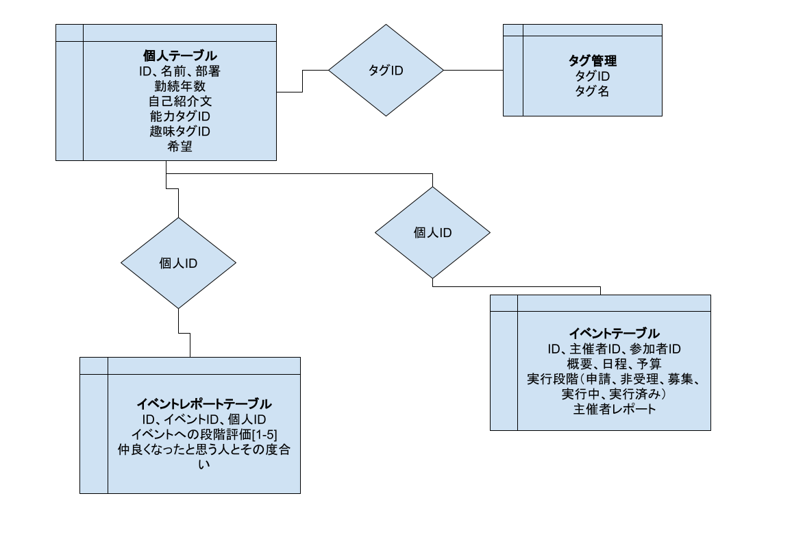

# RSSハッカソン2024

20240621-20240623の間開催されたRSS主催のハッカソン

テーマ：**「あたりまえ」のその先へ**

## アイデアソン_20240621

### アプローチする「あたりまえ」

- アプリケーションはOS別のインストーラーで端末ごとにインストールするのが「あたりまえ」
  - Webアプリ
- Webブラウザではビジュアルに乏しいのが「あたりまえ」
  - WebGL
- 組織内個人の能力のマッチングが難しくて「あたりまえ」
  - 社員能力・趣味をDBで管理
- 組織内個人同士の人間関係は業務に活かせなくて「あたりまえ」
  - 人間関係マッピング
  - グリッド＋PCA三次元
- 組織内個人同士の人間関係は管理できなくてあたりまえ「あたりまえ」
  - マッピングのためのレポート管理
  - 社内イベントを無料で活発的に
    - WeWorkを見れば人間関係や能力がいかに大事かは明白
    - あくまで枠を設けるだけ、人間関係を広めたいという人が参加
    - いつメンができてしまうので参加数が少ない人たちの共通の趣味や能力が活かせるイベントをAIでサジェスト
  - 社内雑談SNS活性化？

- 学習は見て覚えるのが「あたりまえ」
  - 手を動かす
    - よく知らんVue.jsで制作物を作る
  - 教えるために覚える
    - 社内イベントにLT勉強会を含む

### 草案

#### 使用技術

- フロント
  - マッピングのためのWebGL
  - 表示のためのVue.jsとNode.js
- バック
  - DB
  - python
    - マッピングのためのPCA（三次元）とkmeans
    - レポート処理のためのjanome

#### 概要

- 組織内の個人の能力、趣味、希望、人間関係をDBで保持（もちろん個別に公開設定可能）
- 組織内のイベントを簡単に申請し、募集できるシステム

#### 要件定義

- **個人能力、希望検索ページ**
  - 個人をリスト表示、個人情報ページへ遷移
- **個人情報ページ**
  - マッピングへ遷移可能
- **組織内人間関係マッピングページ**
  - 接点の多さや深さでエッジ（線）の太さを変化
  - PCAで3D、kmeansで色
  - 指定の個人を中心座標に持っていく機能
- **イベント作成、募集ページ**
  - 推奨イベントタグで参加数が少ない人たちの共通の趣味や能力
  - イベント作成、申請
    - 概要、スケジュール、予算、最低催行人数、社外人間（家族）参加の可否
  - 受理後、イベント募集へ遷移
- **イベントレポートページ**
  - 個人としてのレポート（アンケートのような軽い物）を提出
    - 仲良くなったと思う人と程度
    - 今回のイベントの段階評価
  - 主催者のレポート提出（会社のSNSやブログに投稿するための形式ばったmarkdown）
    - インシデント報告、申請内容との差異
    - お偉いさんにも見てもらうようにすることで風紀の乱れ過ぎを防止

#### その他基本設計

DB-ER

## ハッカソン_20240622-20240623
