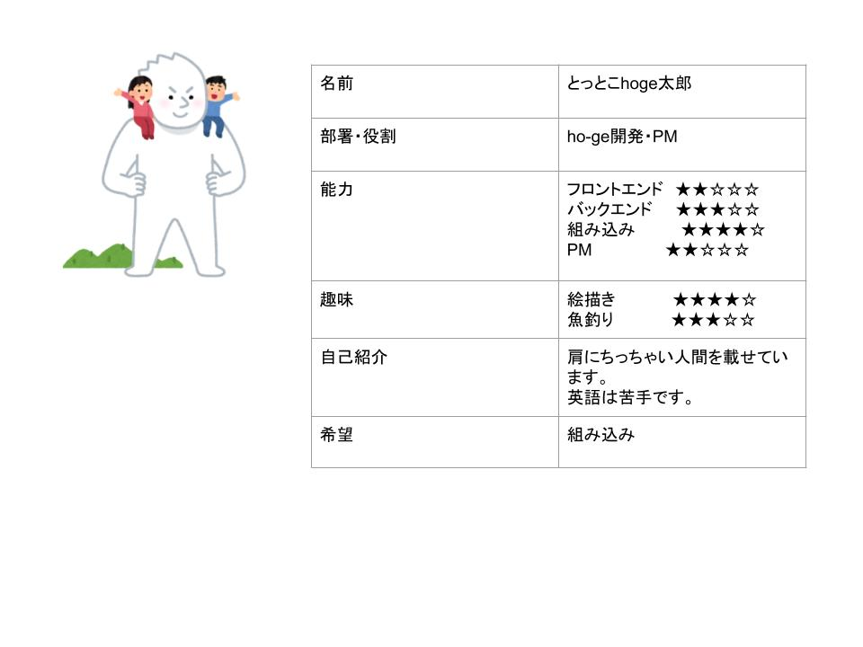

# RSSハッカソン2024 - 人材管理ツール「tendril」

20240621-20240623の間開催されたRSS主催のハッカソン

```sh
pip install flask flask_cors
python flask_ser
cd tendril
npm install
npm run dev
```

## テーマ：**「あたりまえ」のその先へ**

- Webブラウザではビジュアルに乏しいのが「あたりまえ」
  - 3Dで表示するものじゃない？
- 組織内個人の能力のマッチングが難しくて「あたりまえ」
  - 誰がどんな能力を持っているのか人材管理をする人がわからない…
- 組織内個人同士の人間関係は業務に活かせなくて「あたりまえ」
  - あの人とタッグならもっと実力を発揮できるのに…
  - チームの会議がお通屋に！？
- 組織内個人同士の人間関係は管理できなくて「あたりまえ」
  - 外の人には全員の人間関係はわからない！

### ∴「能力」と「人間関係」を一元管理する人材管理ツール

- 能力や趣味で組織内の個人を検索
- WebGLの3Dで人間関係を見える化

まだできていない機能

- イベント管理機能
- 今までのレポートから人間関係をPCAで三次元に圧縮、kmeans分類で着色
- 人間関係、能力を総合してCNN（AI）で適切な開発チームを生成
- レポート提出機能
- ~~発表資料！！！！！！！~~
- その他自己紹介の形態素解析と隠しタグなど…

## アイデアソン_20240621

### アプローチする「あたりまえ」

- アプリケーションはOS別のインストーラーで端末ごとにインストールするのが「あたりまえ」
  - Webアプリ
- Webブラウザではビジュアルに乏しいのが「あたりまえ」
  - WebGL
- 組織内個人の能力のマッチングが難しくて「あたりまえ」
  - 社員能力・趣味をDBで管理
- 組織内個人同士の人間関係は業務に活かせなくて「あたりまえ」
  - 人間関係マッピング
  - グリッド＋PCA三次元
- 組織内個人同士の人間関係は管理できなくて「あたりまえ」
  - マッピングのためのレポート管理
  - 社内イベントを無料で活発的に
    - WeWorkを見れば人間関係や能力がいかに大事かは明白
    - あくまで枠を設けるだけ、人間関係を広めたいという人が参加
    - いつメンができてしまうので参加数が少ない人たちの共通の趣味や能力が活かせるイベントをAIでサジェスト
  - 社内雑談SNS活性化？

- 学習は見て覚えるのが「あたりまえ」
  - 手を動かす
    - よく知らんVue.jsで制作物を作る
  - 教えるために覚える
    - 社内イベントにLT勉強会を含む

### 草案 - 第一サイクル

#### 使用技術

- リポジトリ管理、デプロイ
  - Git
  - GitHub
  - GitHubActions
  - Docker
- フロント
  - マッピングのためのWebGL
  - 表示のためのVue.jsとNode.js
- バック
  - DB
  - python
    - マッピングのためのPCA（三次元）とkmeans

#### 概要

- 組織内の個人の能力、趣味、希望、人間関係をDBで保持（もちろん個別に公開設定可能）
- 組織内のイベントを簡単に申請し、募集できるシステム

#### 要件定義

- **個人能力、希望検索ページ**
  - 個人をリスト表示、個人情報ページへ遷移
- **個人情報ページ**
  - マッピングへ遷移可能
- **組織内人間関係マッピングページ**
  - 接点の多さや深さでエッジ（線）の太さを変化
  - PCAで3D、kmeansで色
  - 指定の個人を中心座標に持っていく機能
- **イベント作成、募集ページ**
  - 推奨イベントタグで参加数が少ない人たちの共通の趣味や能力
  - イベント作成、申請
    - 概要、スケジュール、予算、最低催行人数、社外人間（家族）参加の可否
  - 受理後、イベント募集へ遷移
- **イベントレポートページ**
  - 個人としてのレポート（アンケートのような軽い物）を提出
    - 仲良くなったと思う人と程度
    - 今回のイベントの段階評価
  - 主催者のレポート提出（会社のSNSやブログに投稿するための形式ばったmarkdown）
    - インシデント報告、申請内容との差異
    - お偉いさんにも見てもらうようにすることで風紀の乱れ過ぎを防止

個人情報ページ


能力・希望検索ページ


イベントの申請・催行の流れ


#### その他基本設計など

開発初期にテストケースを作成

DB-ER


### 草案 - 第二サイクル

- DBに実績（開発経験、経歴、資格）を作成、タグを自動割り当て
- 開発チーム新規生成機能
  - 必要な能力タグをあらかじめ入力
  - それに応じた能力の人間を集める
  - 人間関係を考慮
- 自己紹介文章処理のためのjanome
  - マッチング用の隠しタグを生成
- 「似た人と仲良くなりたい」、「知らない人と仲良くなりたい」サジェスト
  - 希望の技術を持つ
  - タグ、隠しタグ、人間関係の大きさでマッチング
    - 距離計算？生成AI？CNN？
- システムへのログイン機能を実装
- APIを生成
  - APIキーを個人テーブルで管理
- リンターとフォーマッターをGitHubActionにセット

### 講評

- 組織として出なく、個人としてのメリットは？
- サービスとして全員のステークホルダーを考えよう

## ハッカソン_20240622-202406

1. 固定テストデータに対する出力、能力検索機能
2. テストレポートに対するFlaskと連携し人間関係図出力
3. DB鯖管理機能
4. 頁分割
